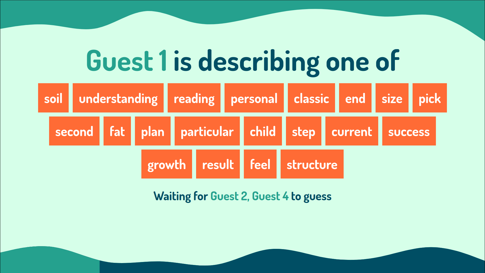

# AirConsole: You talking to me? [(try live)](https://www.airconsole.com/simulator/#debug:https://adamjones.me/airconsole-you-talking-to-me/)

Multiplayer party game, built for the AirConsole platform.

## 🔧 Setup

`npm install`

## 🏃 Running

`npm start`

The game will be availble on `http://localhost:3000`, which can be [opened in the simulator](http://www.airconsole.com/simulator/?http=1#http://localhost:3000)

## ✅ Testing

`npm test`

## 🏗 Building

`npm run build` will build the files in `src` and `public` to `build`

`serve build -p 3000` will serve the files from `build`

## 🎮 Playing with others

On your local network you can use your internal IP address, e.g. `http://www.airconsole.com/#http://192.168.1.101:3000`

Over the internet, you could use something like [ngrok](https://ngrok.com/) with `ngrok http 3000`
